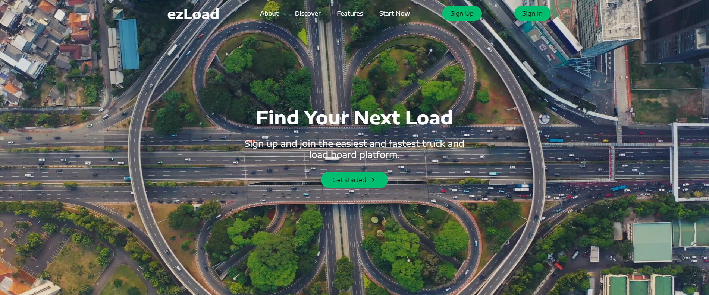

# ezLoad - An easy to navigate load board for truckers and brokers

ezLoad gives truckers and brokers free unlimited access to a reliable load board to find freight whenever they wish. Choose from several trailer types and a variety of load options. Ideal for dispatchers and fleet owners. ezLoad includes helpful features and tools such as the addition of credit score and email notifications. Grow your business by creating posts for free, available to all users. Search through several loads through North America.

## Instructions for use

When you first open up the website, you will be greeted with a stunning live hero section. The navbar contains links that scroll to the infosections that tell a little more about ezLoad. All of the buttons on the home page are responsive and scroll to their respective destination. When you are ready to sign up for the first time, click sign up in the top right hand corner and enter your information, and click "sSign Up". When you sign up, the site will immediately log you in. If you already have an account, click "Sign In", and enter email and password to sign in. When you log in, you will be assigned a JWT token that is used for verification purposes, and helps increase your safety as it only shows the postings and information pages when your specific token is present. When you are logged in, the screen will change to show the log out and view postings buttons. From there, you can click "View Postings" in the center of the hero section. It will then take you to the postings page, where you can view and reserve postings. If you want to add a posting, click "Create Posting" in the top right. Enter the load information and click "Create Post" to post the load. You will now be able to view your post on the main feed. When you are all done, click "Log Out" in the top right corner.

## Site features

- Safe and secure JWT Authentication
- Modern and intuitive front-end designed with React, React Hooks, react-scroll, and styled-components
- REST API developed with Express and Node to add, delete, and get users and posts
- Post and user management using MongoDB

## Pictures

